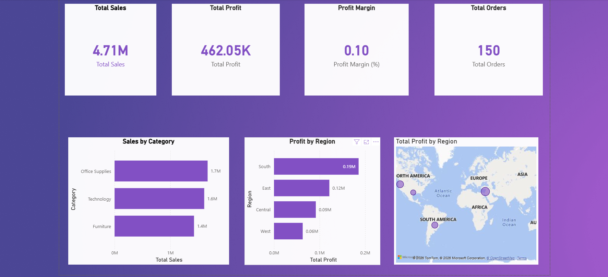

Sales & Profit Performance Dashboard (Power BI)

## 📌 Project Overview
This project presents an **end-to-end Sales & Profit Performance Dashboard** built using **Power BI**.  
The dashboard enables stakeholders to analyze **revenue, profitability, customer behavior, and regional performance** through interactive and visually intuitive reports.

The solution is designed to support **data-driven decision-making** by highlighting trends, top contributors, and underperforming areas across multiple business dimensions.

📸 Dashboard Preview

🎯 Business Objectives
The dashboard addresses the following key business questions:
- What are the **overall sales and profit figures**?
- How do **sales and profit change over time**?
- Which **product categories** contribute the most revenue?
- Which **regions are profitable or loss-making**?
- Who are the **Top 10 customers** driving revenue?
- How can users **dynamically filter** insights by time, region, and category?

## 🛠 Tools & Technologies Used
- **Power BI Desktop** – Data visualization & dashboard development  
- **Power Query** – Data cleaning, transformation, and validation  
- **DAX (Data Analysis Expressions)** – KPI calculations & time intelligence  
- **Data Modeling** – Star Schema (Fact & Dimension tables)  

🧩 Data Model
The dashboard follows a **Star Schema** approach for optimal performance and scalability:

- **Fact Table**
  - Sales (Order Date, Sales, Profit, Quantity, Customer, Product, Region)

- **Dimension Tables**
  - Date (Year, Month, Month-Year, YearMonth Number)
  - Product Category
  - Customer
  - Region

A dedicated **Date table** is used to enable accurate **time-based analysis** such as trends and YoY growth.

📈 Key KPIs
The following KPIs are calculated using optimized **DAX measures**:
- **Total Sales**
- **Total Profit**
- **Profit Margin (%)**
- **Total Orders**
- **Year-over-Year (YoY) Sales Growth**

 📊 Dashboard Features
- **KPI Cards** to display high-level performance metrics
- **Line Chart** to visualize monthly sales trends
- **Bar Chart** to compare sales across product categories
- **Map Visual** to analyze profit distribution by region
- **Top 10 Customers Table** based on Total Sales
- **Interactive Slicers** for:
  - Year
  - Region
  - Category

All visuals respond dynamically to slicer selections.

 🧠 Key Learnings & Challenges
- Built a **custom Date table** to handle time intelligence correctly
- Resolved **Date vs DateTime relationship issues** to ensure accurate calculations
- Implemented **Top N filtering** for customer analysis
- Applied best practices in **DAX measure creation**
- Designed a dashboard focused on **business usability**, not just visuals

📂 Files in This Repository
- `Sales_Profit_Performance_Dashboard.pbix`  
  → Main Power BI dashboard file  
- `dashboard.png`  
  → Dashboard preview image  

 ▶️ How to Use This Project
1. Download the `.pbix` file from this repository
2. Open it using **Power BI Desktop**
3. Use slicers to interactively explore insights
4. Analyze trends, categories, regions, and customers

 👤 Author
**Rakesh**  
Aspiring Data Analyst | Power BI Developer  

🔗 GitHub: https://github.com/RAKI9000

 📌 Project Highlights (Resume Ready)
- Developed a **fully interactive Power BI dashboard** for sales & profit analysis
- Used **DAX and time intelligence** for KPI calculations
- Implemented **star schema data modeling**
- Published the project on **GitHub with documentation & visuals**
